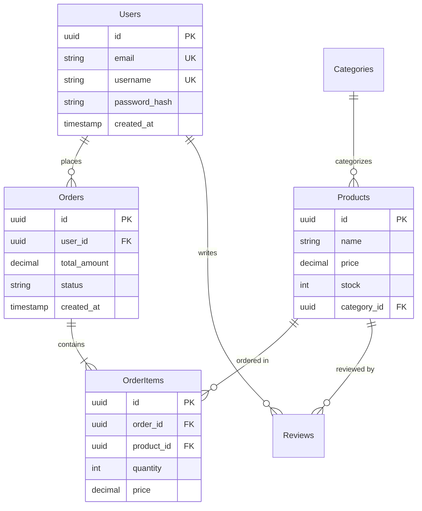

# Database Schema Design

## Overview

Design and optimize SQL and NoSQL database schemas with normalization, indexing, constraints, triggers, and migration strategies — delivering ERD diagrams, DDL, migration files, and documentation.

## When to Use

- **New Project**: Database schema design for a new application
- **Schema Refactoring**: Redesigning an existing schema for performance or scalability
- **Relationship Definition**: Implementing 1:1, 1:N, N:M relationships
- **Migration**: Safely applying schema changes
- **Performance Issues**: Index and schema optimization to resolve slow queries

## Input Requirements

### Required
- **Database Type**: PostgreSQL, MySQL, MongoDB, SQLite, etc.
- **Domain Description**: What data will be stored (e.g., e-commerce, blog, social media)
- **Key Entities**: Core data objects (e.g., User, Product, Order)

### Optional
- Expected Data Volume: Small (<10K), Medium (10K–1M), Large (>1M) — default: Medium
- Read/Write Ratio: Read-heavy, Write-heavy, Balanced — default: Balanced
- Transaction Requirements: ACID required — default: true
- Sharding/Partitioning: Large data distribution needed — default: false

### Input Example

> Design a database for an e-commerce platform:
> - DB: PostgreSQL
> - Entities: User, Product, Order, Review
> - A User can have multiple Orders
> - An Order contains multiple Products (N:M)
> - A Review is linked to a User and a Product
> - Expected data: 100,000 users, 10,000 products
> - Read-heavy (frequent product lookups)

## Core Workflow

### Step 1: Define Entities and Attributes

Extract nouns from requirements → entities → attributes → types → primary keys.

**Tasks:**
- Extract nouns from business requirements → entities
- List each entity's attributes (columns)
- Determine data types (VARCHAR, INTEGER, TIMESTAMP, JSON, etc.)
- Designate Primary Keys (UUID vs Auto-increment ID)

**Example (E-commerce):**

```
Users
- id: UUID PRIMARY KEY
- email: VARCHAR(255) UNIQUE NOT NULL
- username: VARCHAR(50) UNIQUE NOT NULL
- password_hash: VARCHAR(255) NOT NULL
- created_at: TIMESTAMP DEFAULT NOW()
- updated_at: TIMESTAMP DEFAULT NOW()

Products
- id: UUID PRIMARY KEY
- name: VARCHAR(255) NOT NULL
- description: TEXT
- price: DECIMAL(10,2) NOT NULL
- stock: INTEGER DEFAULT 0
- category_id: UUID REFERENCES Categories(id)
- created_at: TIMESTAMP DEFAULT NOW()

Orders
- id: UUID PRIMARY KEY
- user_id: UUID REFERENCES Users(id)
- total_amount: DECIMAL(10,2) NOT NULL
- status: VARCHAR(20) DEFAULT 'pending'
- created_at: TIMESTAMP DEFAULT NOW()

OrderItems (Junction)
- id: UUID PRIMARY KEY
- order_id: UUID REFERENCES Orders(id) ON DELETE CASCADE
- product_id: UUID REFERENCES Products(id)
- quantity: INTEGER NOT NULL
- price: DECIMAL(10,2) NOT NULL
```

### Step 2: Design Relationships and Normalization

| Relationship | Implementation |
|-------------|----------------|
| 1:1 | Foreign Key + UNIQUE constraint |
| 1:N | Foreign Key |
| N:M | Junction table with composite PK |

**Normalization decision criteria:**
- OLTP systems → normalize to 3NF (data integrity)
- OLAP/analytics → denormalization allowed (query performance)
- Read-heavy → minimize JOINs with partial denormalization
- Write-heavy → full normalization to eliminate redundancy

**ERD (Mermaid):**



### Step 3: Establish Indexing Strategy

**Checklist:**
- [ ] Indexes on frequently queried columns (WHERE clauses)
- [ ] Indexes on Foreign Key columns (JOIN performance)
- [ ] Composite indexes for multi-column queries (high-selectivity columns first)
- [ ] Avoid excessive indexes (degrades INSERT/UPDATE performance)
- [ ] Partial indexes for sparse data
- [ ] Full-text search indexes when needed

**Example (PostgreSQL):**

```sql
-- Primary Keys (auto-indexed)
CREATE TABLE users (
    id UUID PRIMARY KEY DEFAULT gen_random_uuid(),
    email VARCHAR(255) UNIQUE NOT NULL,
    username VARCHAR(50) UNIQUE NOT NULL,
    password_hash VARCHAR(255) NOT NULL,
    created_at TIMESTAMP DEFAULT NOW(),
    updated_at TIMESTAMP DEFAULT NOW()
);

CREATE TABLE orders (
    id UUID PRIMARY KEY DEFAULT gen_random_uuid(),
    user_id UUID NOT NULL REFERENCES users(id) ON DELETE CASCADE,
    total_amount DECIMAL(10,2) NOT NULL,
    status VARCHAR(20) DEFAULT 'pending',
    created_at TIMESTAMP DEFAULT NOW()
);

-- Explicit indexes for FK and query columns
CREATE INDEX idx_orders_user_id ON orders(user_id);
CREATE INDEX idx_orders_status ON orders(status);
CREATE INDEX idx_orders_created_at ON orders(created_at);
CREATE INDEX idx_orders_status_created ON orders(status, created_at DESC);

CREATE TABLE products (
    id UUID PRIMARY KEY DEFAULT gen_random_uuid(),
    name VARCHAR(255) NOT NULL,
    price DECIMAL(10,2) NOT NULL CHECK (price >= 0),
    stock INTEGER DEFAULT 0 CHECK (stock >= 0),
    category_id UUID REFERENCES categories(id),
    created_at TIMESTAMP DEFAULT NOW()
);

CREATE INDEX idx_products_category ON products(category_id);
CREATE INDEX idx_products_price ON products(price);
CREATE INDEX idx_products_name ON products(name);

-- Full-text search index (PostgreSQL)
CREATE INDEX idx_products_name_fts ON products
    USING GIN(to_tsvector('english', name));
```

### Step 4: Set Up Constraints and Triggers

**Constraints:**

```sql
CREATE TABLE products (
    id UUID PRIMARY KEY DEFAULT gen_random_uuid(),
    name VARCHAR(255) NOT NULL,
    price DECIMAL(10,2) NOT NULL CHECK (price >= 0),
    stock INTEGER DEFAULT 0 CHECK (stock >= 0),
    discount_percent INTEGER CHECK (discount_percent >= 0 AND discount_percent <= 100),
    category_id UUID REFERENCES categories(id) ON DELETE SET NULL,
    created_at TIMESTAMP DEFAULT NOW(),
    updated_at TIMESTAMP DEFAULT NOW()
);
```

**Trigger for auto-updating `updated_at`:**

```sql
CREATE OR REPLACE FUNCTION update_updated_at_column()
RETURNS TRIGGER AS $$
BEGIN
    NEW.updated_at = NOW();
    RETURN NEW;
END;
$$ LANGUAGE plpgsql;

CREATE TRIGGER update_products_updated_at
    BEFORE UPDATE ON products
    FOR EACH ROW EXECUTE FUNCTION update_updated_at_column();
```

### Step 5: Write Migration Scripts

Each migration must have UP (apply) and DOWN (rollback) in transactions.

**UP migration:**

```sql
-- migrations/001_create_initial_schema.up.sql
BEGIN;

CREATE EXTENSION IF NOT EXISTS "uuid-ossp";

CREATE TABLE users (
    id UUID PRIMARY KEY DEFAULT gen_random_uuid(),
    email VARCHAR(255) UNIQUE NOT NULL,
    username VARCHAR(50) UNIQUE NOT NULL,
    password_hash VARCHAR(255) NOT NULL,
    created_at TIMESTAMP DEFAULT NOW(),
    updated_at TIMESTAMP DEFAULT NOW()
);

CREATE TABLE categories (
    id UUID PRIMARY KEY DEFAULT gen_random_uuid(),
    name VARCHAR(100) UNIQUE NOT NULL,
    parent_id UUID REFERENCES categories(id)
);

CREATE TABLE products (
    id UUID PRIMARY KEY DEFAULT gen_random_uuid(),
    name VARCHAR(255) NOT NULL,
    description TEXT,
    price DECIMAL(10,2) NOT NULL CHECK (price >= 0),
    stock INTEGER DEFAULT 0 CHECK (stock >= 0),
    category_id UUID REFERENCES categories(id),
    created_at TIMESTAMP DEFAULT NOW(),
    updated_at TIMESTAMP DEFAULT NOW()
);

CREATE INDEX idx_products_category ON products(category_id);
CREATE INDEX idx_products_price ON products(price);

COMMIT;
```

**DOWN migration:**

```sql
-- migrations/001_create_initial_schema.down.sql
BEGIN;

DROP TABLE IF EXISTS products CASCADE;
DROP TABLE IF EXISTS categories CASCADE;
DROP TABLE IF EXISTS users CASCADE;

COMMIT;
```

## Output Format

```
project/
├── database/
│   ├── schema.sql                  # Full DDL
│   ├── migrations/
│   │   ├── 001_create_users.up.sql
│   │   ├── 001_create_users.down.sql
│   │   ├── 002_create_products.up.sql
│   │   └── 002_create_products.down.sql
│   ├── seeds/
│   │   └── sample_data.sql         # Test data
│   └── docs/
│       ├── ERD.md                   # Mermaid ERD
│       └── SCHEMA.md                # Documentation
└── README.md
```

**Table documentation format:**

```markdown
### users
- **Purpose**: Store user account information
- **Indexes**: email, username
- **Estimated rows**: 100,000
```

## Constraints

### Required (MUST)
- **Primary Key Required**: Every table must have a Primary Key
- **Explicit Foreign Keys**: Related tables must define FKs with ON DELETE CASCADE/SET NULL
- **NOT NULL Appropriately**: Required columns must be NOT NULL; provide defaults

### Prohibited (MUST NOT)
- **EAV Pattern Abuse**: Avoid Entity-Attribute-Value except in special cases (query complexity, performance)
- **Excessive Denormalization**: Denormalize only when profiling proves necessary (consistency risk)
- **Plaintext Sensitive Data**: Never store passwords, card numbers, etc. in plaintext

### Security Rules
- **Least Privilege**: Grant only necessary permissions to application DB accounts
- **SQL Injection Prevention**: Always use prepared statements / parameterized queries
- **Encrypt Sensitive Columns**: Encrypt PII at rest

## Best Practices

- **Naming Convention**: Use `snake_case` — tables plural (`users`, `post_tags`), columns singular (`created_at`)
- **Soft Delete**: Use `deleted_at TIMESTAMP` (NULL = active, NOT NULL = deleted) for important data
- **Timestamps**: Include `created_at` and `updated_at` in most tables
- **Partial Indexes**: Minimize index size — `CREATE INDEX ... ON posts(published_at) WHERE published_at IS NOT NULL`
- **Materialized Views**: Cache complex aggregate queries
- **Partitioning**: Partition large tables by date/range for maintainability

## Common Mistakes

| Mistake | Correction |
|---------|-----------|
| N+1 queries in loops | Use JOINs or eager loading |
| Missing indexes on FK columns | Add `CREATE INDEX` for every FK used in JOINs |
| UUID performance issues | Use time-ordered UUID v7 or auto-increment BIGINT |
| No rollback plan for migrations | Always write DOWN migrations |
| Over-indexing (too many indexes) | Profile query patterns; remove unused indexes |
| Storing computed values without sync | Use generated columns or views instead |

## Related Skills

- **api-design**: API schemas that mirror database models
- **performance-optimization**: Query performance and N+1 detection

## References

- [PostgreSQL Documentation](https://www.postgresql.org/docs/)
- [MySQL Documentation](https://dev.mysql.com/doc/)
- [MongoDB Schema Design Best Practices](https://www.mongodb.com/docs/manual/core/data-modeling-introduction/)
- [Use The Index, Luke](https://use-the-index-luke.com/) — SQL indexing guide
- [dbdiagram.io](https://dbdiagram.io/) — ERD diagram tool
